# Partner Frontier AI Workshop

## 코드 샘플로 Microsoft Agent Framework의 기본 컨셉 이해하기

### Microsoft Foundry 생성하기

Azure AI Foundry는 11월에 있었던 Microsoft Ignite에서 Microsoft로 브랜드가 변경되었습니다. 이번 단계에서는 Azure Portal에서 Microsoft Foundry 리소스를 생성하고 GPT-4.1 모델을 배포합니다.

1. Azure Portal 검색 창에 Microsoft Foundry를 입력합니다.

    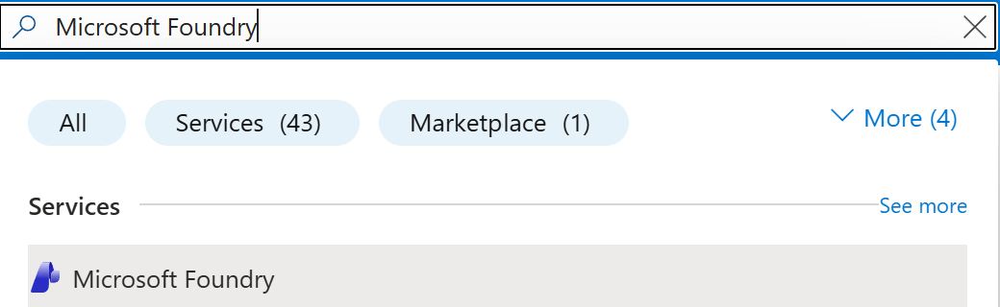

2. Microsoft Foundry 리소스를 생성합니다.

    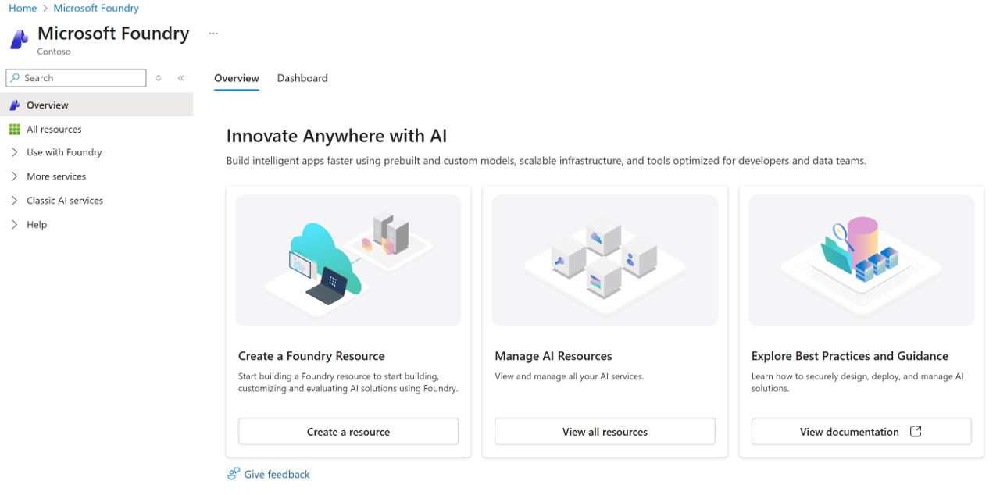

3. 구독, 리소스 그룹, 리소스명을 선택 및 입력하고 지역은 "East US"를 선택합니다. 프로젝트명은 default로 남겨둡니다. 네트워크등의 탭은 기본 값으로 설정 후 "생성" 버튼을 눌러 리소스를 생성합니다.

    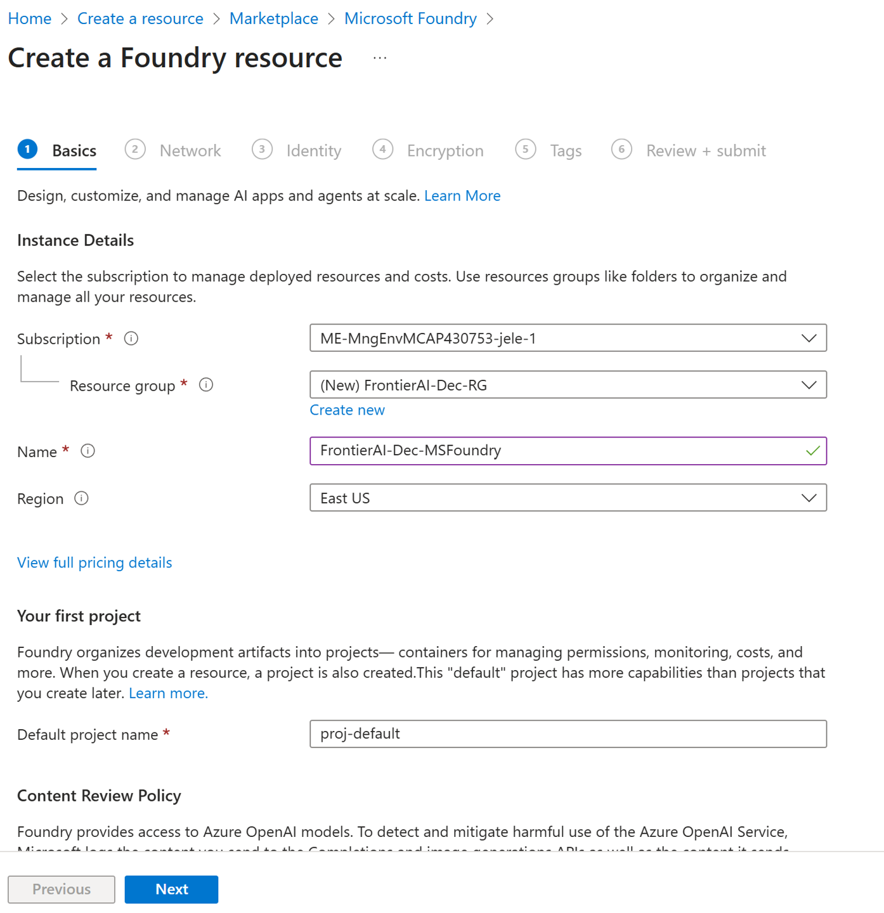

4. 생성이 완료되면 default project로 이동하게 됩니다. Microsoft Foundry Project의 Endpoint와 Key 값을 볼 수 있습니다. 왼쪽 메뉴의 "Models + endpoints"를 클릭하여 모델 배포 작업을 해봅니다.

    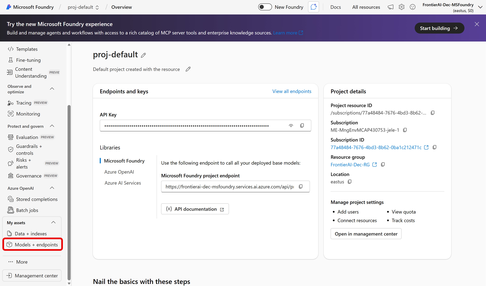

5. 이번 실습에서는 gpt-4.1 모델을 사용할 예정입니다. 구독에 할당량이 부족한 경우 gpt-4.1-mini등 다른 AOAI 모델을 사용해도 괜찮습니다.

    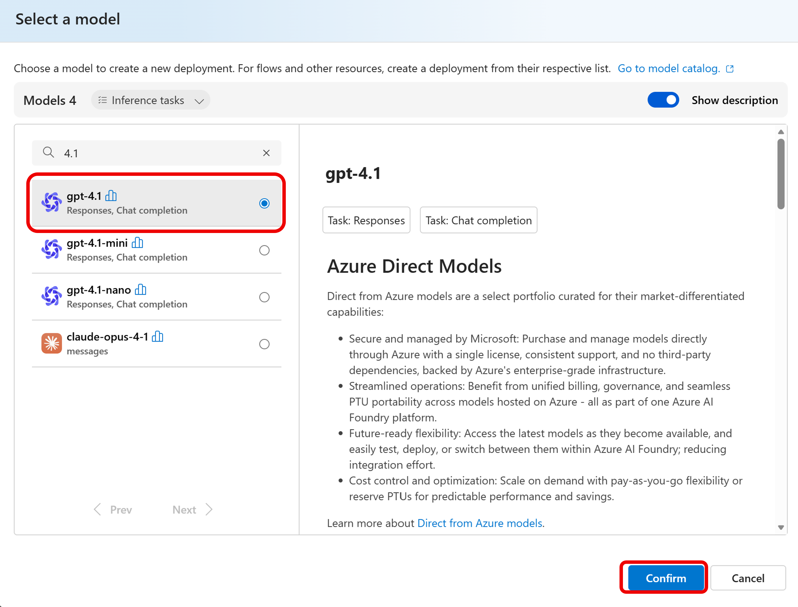

6. Deployment type은 "Global Standard"로 선택하고 다른 값은 디폴트를 선택한 후 배포합니다. 배포된 모델명은 "gpt-4.1"로 선택하거나, 이름을 변경하였을 경우 해당 이름을 기록해 둡니다. 이후 코드 샘플에서 필요합니다.

    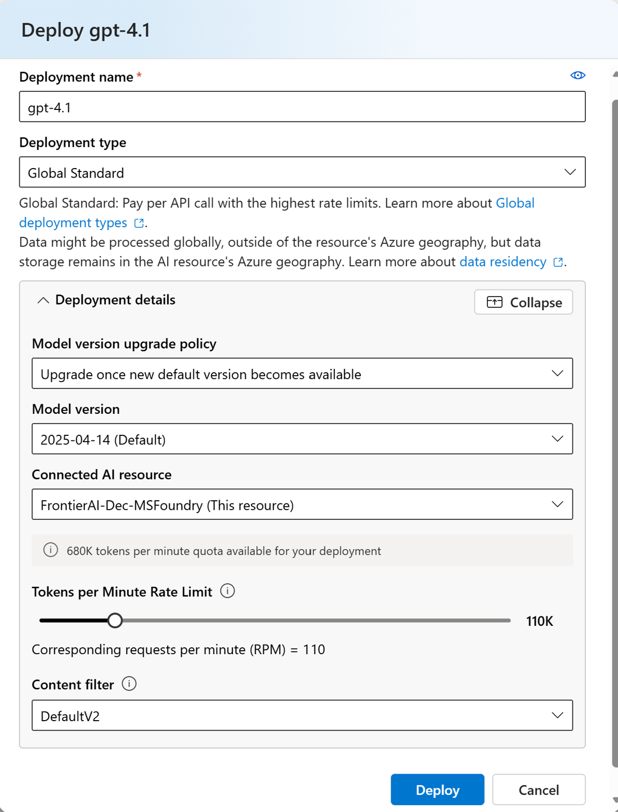

7. 모델 배포가 완료되면, Chat Playground에서 모델을 테스트해볼 수 있습니다. 왼쪽 메뉴의 "Chat playground"를 클릭합니다. 모델명 드롭다운에서 방금 배포한 모델명을 선택하고, 프롬프트에 "Hello, Microsoft Foundry!"를 입력한 후 "Submit" 버튼을 눌러봅니다. 

    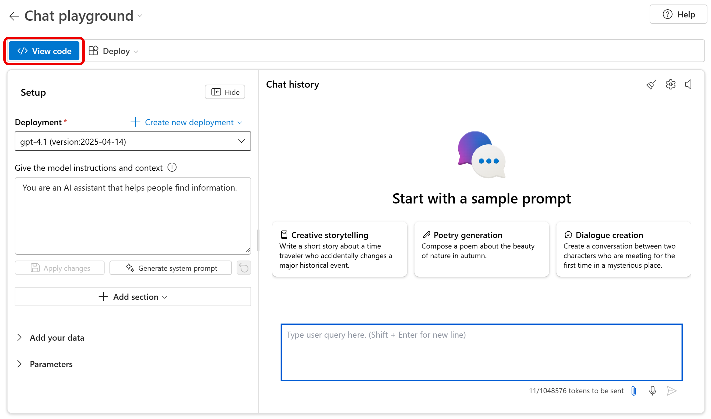

8. "View code" 버튼을 클릭하면, Azure OpenAI의 endpoint를 볼 수 있습니다. 이 값을 기록해 두고 다음 단계의 환경변수 셋팅에서 사용합니다.

    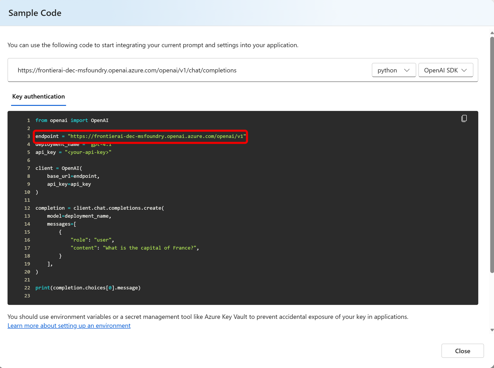

### Bing Grounding 생성하기

이번 단계에서는 Bing Grounding 리소스를 생성합니다. Bing Grounding은 Microsoft Agent Framework에서 제공하는 웹 검색 도구로, 에이전트가 실시간 정보를 검색할 수 있도록 도와줍니다.

1. Azure Portal 검색 창에 Bing Resource를 입력합니다.

    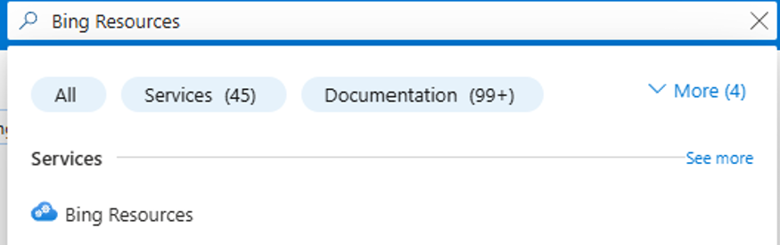

2. "+Add" 버튼을 클릭하고 "Grounding with Bing Search"를 선택하여 Bing Grounding 리소스를 생성합니다.

    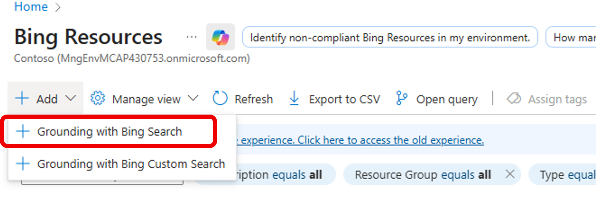

3. 구독, 리소스 그룹, 리소스명을 선택 및 입력하고 지역은 "Global"를 선택합니다. 기본 가격 티어를 선택 후 "검토 + 생성" 버튼을 눌러 리소스를 생성합니다.

    

4. 리소스 생성이 완료되면, "Go to resource" 버튼을 클릭하여 리소스 페이지로 이동합니다. Bing Grounding 리소스는 Microsoft Foundry Portal에서 사용되므로, Foundry Portal로 이동합니다.

    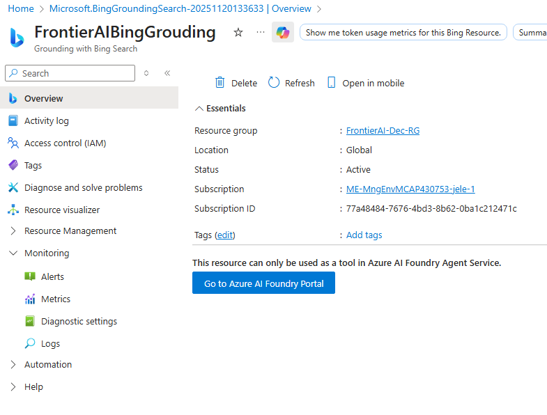

5. Foundry Portal에서 "Management Center"를 클릭합니다. 

    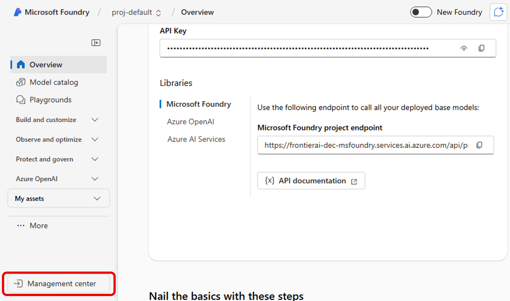

6. 왼쪽 메뉴에서 "Connected Resources"를 선택하고, "Create Connection" 버튼을 클릭합니다.

    

7. Asset type에서 "Bing Grounding"을 선택합니다.

    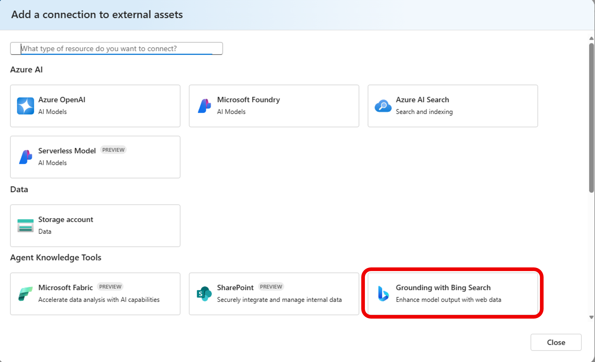

8. 이전 단계에서 생성한 Bing Grounding 리소스를 선택하고, "Add connection"" 버튼을 클릭합니다.

    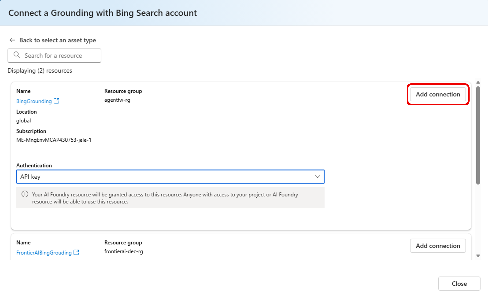

9. 연결이 완료되면, 연결된 리소스 목록에서 방금 생성한 Bing Grounding 연결을 확인할 수 있습니다. 해당 Grounding Name을 클릭하여 상세 정보를 확인합니다.

    

10. 연결된 Bing Grounding 리소스의 Connection ID를 기록해 둡니다. 이후 코드 샘플에서 필요합니다.

### 코드에서 Agent Framework 구현하기

이제 사용할 Azure 리소스를 모두 생성하였으므로, 코드에서 Microsoft Agent Framework를 구현하는 단계로 넘어갑니다.

1. 환경 변수 설정하기

이번 단계에서는 앞서 생성한 Microsoft Foundry와 Bing Grounding 리소스의 정보를 환경 변수로 설정합니다. ./1_basic_agent/.env.sample 파일을 ./1_basic_agent/.env 파일로 변경하고 Azure OpenAI, Foundry Project, Bing Grounding 정보를 입력합니다.

2. 코드 샘플 실행하기

코드 샘플은 Jupyter Notebook 형식으로 제공됩니다. 1_basic-concept-with-msaf.ipynb 파일을 열고, 각 셀을 순서대로 실행하여 Microsoft Agent Framework의 기본 컨셉을 이해합니다. 이번 실습에서는 아래의 세가지 케이스를 다룹니다.

* Case 1: 기본 에이전트 생성과 실행
* Case 2: Custom Tools/Functions 활용한 Agents 
* Case 4: Azure AI Agent Client를 활용한 엔터프라이즈 도구

[원본 Repository](https://github.com/Azure/agent-innovator-lab/blob/main/0_basic-agent/AgentFramework/README.md)에는 Case 3: Understand the differences b/w Agent Clients (Azure OpenAI Chat Client vs Azure AI Agent Client)도 포함되어 있으니, 시간 내셔서 전체 코드를 실습해 보시길 권장드립니다.

1_basic-concept-with-msaf.ipynb 파일의 코드를 모두 실행하신 분은 Part 2로 넘어가시면 됩니다.

## 다음 단계

* [Hands-on Lab 0 – Setup](2_00_setup.md)

## 실습 순서

### Part 1
* [Microsoft Agent Framework Basic Concept HoL](1_basic_concept.md)

### Part 2
* [Hands-on Lab 0 – Setup](2_00_setup.md)
* [Hands-on Lab 1 – MCP Server](2_01_mcp_uv.md)
* [Hands-on Lab 2 – Backend](2_02_backend_uv.md)
* [Hands-on Lab 3 – Frontend](2_03_frontend.md)

