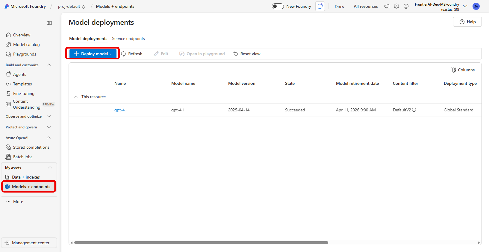
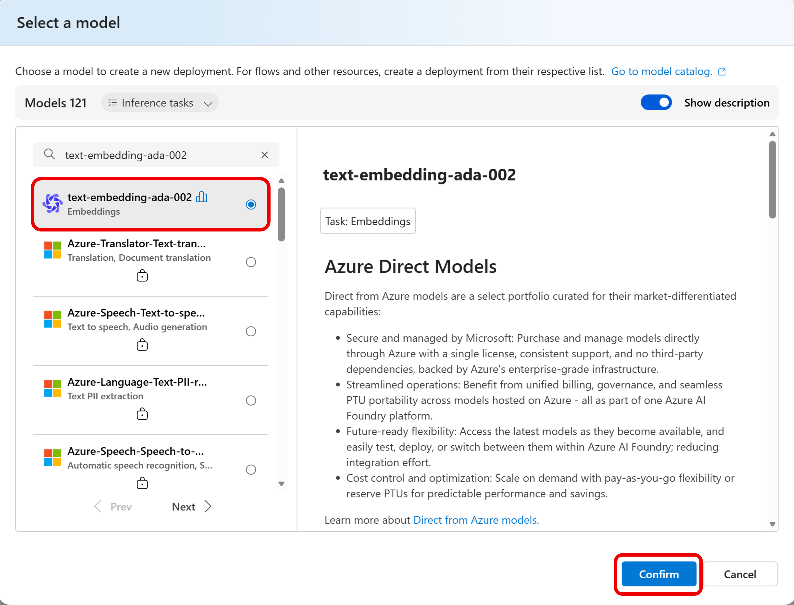
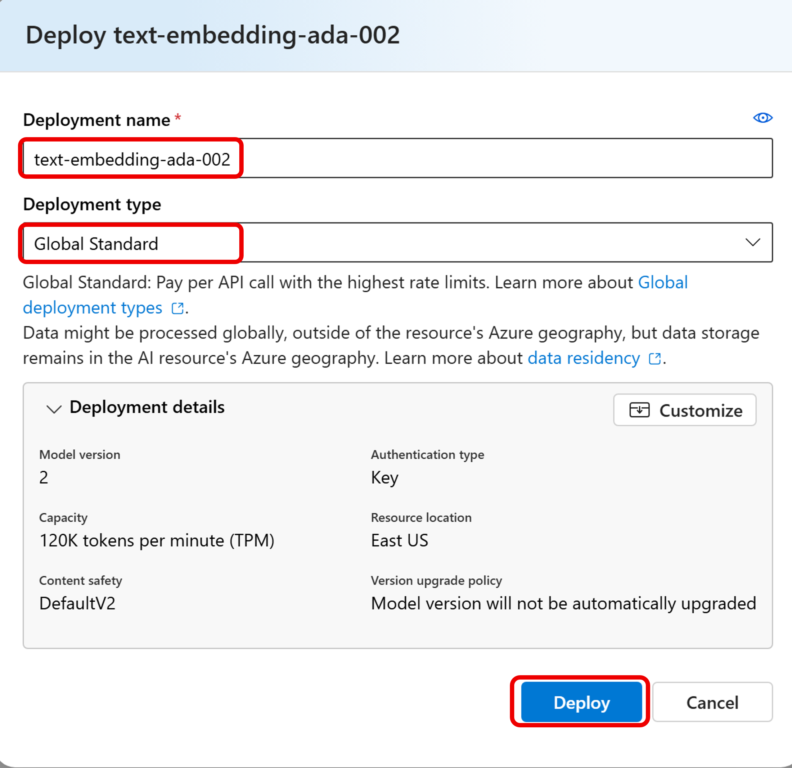

# Part 2: Microsoft AI Agentic Workshop

> Note: 워크샵 시나리오 개요는 설정을 시작하기 전에 [여기](SCENARIO.md)에서 읽어보세요.

## Step 1: Workshop Setup
이 단계에서는 워크샵을 실행하는 데 필요한 리포지토리를 복제하고, Azure AI Foundry에서 LLM 모델을 배포하고, 환경 변수를 설정하는 방법을 안내합니다.

## 사전준비사항
- Azure 구동
- 사전 지식:
    - Azure 구독과 리소스
    - Github Mechanics (계정 생성, 리포지토리 복제 등)
  
### 1. 터미널 열기 및 리포지토리 복제

>  VS Code에서 새 터미널 창을 엽니다:

터미널에서 다음 명령어를 실행하여 리포지토리를 복제합니다:

```bash 
git clone https://github.com/jeongaelee/frontierai.git 
```

### 2. Microsoft Foundry에서 LLM 모델 배포

[이전 단계](1_basic_concept.md)에서 배포한 Microsoft Foundry 프로젝트와 GPT-4.1 모델을 사용합니다.
  
### 3. 환경 변수 설정 
  
`agentic_ai/applications` 폴더의 `.env.sample` 파일 이름을 `.env`로 변경하고, 필요한 모든 필드를 채웁니다. 다음은 샘플 구성입니다:  
  
```bash  
############################################  
#  Azure OpenAI – chat model configuration #  
############################################  
# Replace with your model-deployment endpoint in Azure AI Foundry  
AZURE_OPENAI_ENDPOINT="https://YOUR-OPENAI-SERVICE-ENDPOINT.openai.azure.com"  
  
# Replace with your Foundry project’s API key  
AZURE_OPENAI_API_KEY="YOUR-OPENAI-API-KEY"  
  
# Connection-string that identifies your Foundry project / workspace. Only needed if you're using Azure Agent Service
AZURE_AI_AGENT_PROJECT_CONNECTION_STRING="YOUR-OPENAI-PROJECT-CONNECTION-STRING"  
  
# Model deployment & API version  
AZURE_OPENAI_CHAT_DEPLOYMENT="gpt-4.1"  
AZURE_AI_AGENT_MODEL_DEPLOYMENT_NAME="gpt-4.1" # only needed if you're using Azure Agent Service 
AZURE_OPENAI_API_VERSION="2025-01-01-preview"  
OPENAI_MODEL_NAME="gpt-4.1-2025-04-14"  #only applicable for Autogen
  
############################################  
#     Local URLs for backend & MCP server  #  
############################################  
BACKEND_URL="http://localhost:7000"  
MCP_SERVER_URI="http://localhost:8000/mcp"  
  
############################################  
#         Agent module to be executed      #  
############################################  
AGENT_MODULE="agents.agent_framework.single_agent"
# AGENT_MODULE="agents.agent_framework.multi_agent.handoff_multi_domain_agent"
# AGENT_MODULE="agents.agent_framework.multi_agent.magentic_group"
  
############################################  
#       State store configuration          #
############################################
DATA_TENANT_ID="default"  
```
  
### 4. Microsoft Foundry에 임베딩 모델 배포

1. Microsoft Foundry에서 동일한 프로젝트 내에서 **Models + endpoints**에서 모델 배포를 합니다.
    
    

2. text-embedding-ada-002 모델을 선택합니다.

    

3. 배포 타입으로 **Global Standard**를 선택하고, 원하는 경우 **Korea Central** 지역을 선택합니다.

    

4. 소스 리포지토리에서 루트 폴더로 이동한 후, `mcp` 폴더로 이동하여 `.env.sample` 파일 이름을 `.env`로 변경하고, 필요한 모든 필드를 채웁니다. 다음은 샘플 구성입니다:
  
    ```bash
    # This file is a sample configuration for the MCP backend services's knowledge retrieval APIs which uses text-embedding-ada-002 embedding model
    AZURE_OPENAI_ENDPOINT="YOUR-OPENAI-SERVICE-ENDPOINT.openai.azure.com"
    AZURE_OPENAI_API_KEY="YOUR-OPENAI-API-KEY"
    AZURE_OPENAI_API_VERSION=2025-03-01-preview
    AZURE_OPENAI_EMBEDDING_DEPLOYMENT="text-embedding-ada-002"
    DB_PATH="data/contoso.db"
    AAD_TENANT_ID=""
    MCP_API_AUDIENCE=""
    MCP_SERVER_URI="http://localhost:8000/mcp"
    DISABLE_AUTH="true"
    ```


**Azure 리소스가 올바른 모델 배포 이름, 엔드포인트 및 API 버전을 사용하도록 구성되었는지 확인하세요.**
  
---

## 다음 단계: MCP Server
`.env` 파일이 구성되면 MCP 서버를 시작할 수 있습니다.

* [Hands-on Lab 1 – MCP Server](2_01_mcp_uv.md)

## 실습 순서

### Part 1
* [Microsoft Agent Framework Basic Concept HoL](00_basic_concept.md)

### Part 2
* [Hands-on Lab 0 – Setup](2_00_setup.md)
* [Hands-on Lab 1 – MCP Server](2_01_mcp_uv.md)
* [Hands-on Lab 2 – Backend](2_02_backend_uv.md)

* [Hands-on Lab 3 – Frontend](2_03_frontend_react.md)
