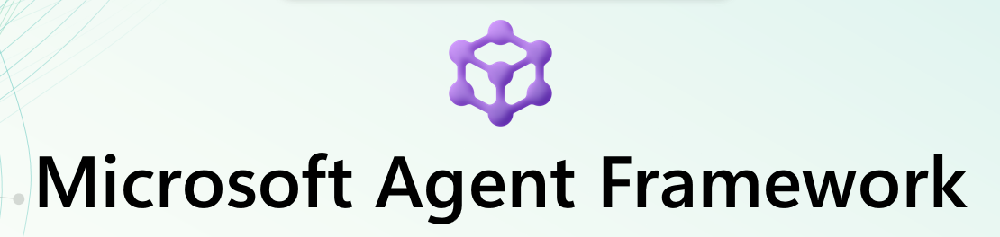

# Partner Frontier AI Workshop

## Microsoft Agent Framework



Microsoft Agent Framework은 Azure AI Foundry에서 제공하는 에이전트 개발 프레임워크로, 다양한 AI 모델과 서비스를 활용해 지능형 에이전트를 손쉽게 구축할 수 있도록 지원합니다. 
이 프레임워크는 다음과 같은 특징을 갖습니다:

* 유연한 아키텍처: 다양한 AI 모델과 서비스(Azure OpenAI, Cognitive Services 등)와 통합되어 대화형, 자동화, 멀티모달 시나리오를 지원합니다.
* 엔터프라이즈급 보안 및 거버넌스: 인증, 권한 관리, 데이터 보호 기능을 기본 제공하여 안전한 AI 에이전트 운영을 보장합니다.
* 확장성과 개발자 친화성: 파트너와 개발자가 맞춤형 기능을 추가하고, Azure AI Foundry와 연계해 빠르고 효율적인 에이전트 워크플로우를 구현할 수 있습니다.

## Hands-on Lab 개요

본 실습 과정은 한국 마이크로소프트와 파트너의 기술 협력 프로그램 중 하나인 Partner Fonrtier AI 캠페인의 일부로 진행되는 실습 교육입니다. 본 과정에서는 최근 Microsoft Agent Framework으로 통합된 Microsoft Azure의 에이전트 오케스트레이션 방안에 대하여 이론과 실습을 함께 진행합니다.

* Part 1에서는 Jupyter Notebook을 사용하여 ipython 코드 샘플로 Microsoft Agent Framework의 기본 개념을 이해해 봅니다.
* Part 2에서는 샘플 애플리케이션으로 Azure AI Foundry와 MCP 서버를 연결하고, Backend/Frontend 앱을 실행해 봅니다. 다양한 멀티 에이전에 오케스트레이션 패턴을 실습합니다.

## 사전 요구 사항 (필요 도구)

* Azure 구독: Azure AI Foundry등의 Azure 리소스를 배포하게 됩니다. 권한이 있으신지 확인해주세요.
* Visual Studio Code 설치: https://code.visualstudio.com/
* Python 3.13 version 설치 (*일부 OS에서는 3.14 버전으로 Microsoft Agent Frameworkd이 설치되지 않는 경우가 있습니다.)
* [Azure CLI](https://learn.microsoft.com/ko-kr/cli/azure/install-azure-cli-windows?view=azure-cli-latest&pivots=winget)를 Install 해주세요 (VS Code의 터미널에서 설치했을 경우 VS Code를 재구동 해주세요.)

    ```
    winget install --exact --id Microsoft.AzureCLI
    ```

* 아래 모듈을 Terminal에서 Install 해주세요.

    ```
    pip install agent-framework --pre
    ```

* 터미널 열기 및 리포지토리 복제

>  VS Code에서 새 터미널 창을 엽니다:

터미널에서 다음 명령어를 실행하여 리포지토리를 복제합니다:

```bash 
git clone https://github.com/jeongaelee/frontierai.git
```

## 사용 Azure 리소스 및 환경

* Azure OpenAI
* Bing Grouding

## .env 파일

본 실습에서는 3개의 .env 파일을 사용합니다. 각각의 .env 파일은 다음과 같은 용도로 사용됩니다:

### Part 1의 Microsoft Agent Framework Basic Concept HoL에서는 1개의 .env 파일을 사용합니다. 
* ./1_basic_agent/.env.sample ==> 1_basic-concept-with-msaf.ipynb을 위한 .env

### Part 2의 Hands-on Lab에서는 2개의 .env 파일을 사용합니다.
* ./agentic_ai/application/.env.sample ==> Agent application을 위한 .env
* ./mcp/.env.sample ==> MCP server를 위한 .env

## 실습 순서

### Part 1
* [Microsoft Agent Framework Basic Concept HoL](docs/1_basic_concept.md)

### Part 2
* [Hands-on Lab 0 – Setup](docs/2_00_setup.md)
* [Hands-on Lab 1 – MCP Server](docs/2_01_mcp_uv.md)
* [Hands-on Lab 2 – Backend](docs/2_02_backend_uv.md)
* [Hands-on Lab 3 – Frontend](docs/2_03_frontend_react.md)

## 참고 및 인용된 Repository

* Part 1의 basic-concept-with-msaf.ipynb 코드는 [Agent Innovator Lab](https://github.com/Azure/agent-innovator-lab)에서 차용 되었습니다. Agent Innovator Lab 리포지토리는 마이크로소프트의 AI GBB 팀에서 운영하는 Repo로 Microsoft Azure 기반으로 AI 에이전트 개발을 학습할 수 있는 실습 중심의 자료를 제공하고 있습니다. 이 리포지토리는 RAG 구현, 에이전트 설계 패턴, 평가 및 최적화 기법을 포함한 다양한 모듈을 통해 개발자가 실제 환경에서 에이전트를 구축하고 개선하는 경험을 지원합니다.

* Part 2의 [Microsoft AI Agentic Workshop](https://github.com/aseangps/OpenAIWorkshop)은 마이크로소프트에서 제공하는 repo로 OpenAI 기반 지능형 솔루션을 구축하기 위한 워크숍 자료와 코드를 제공하고 있습니다. 이 리포지토리를 통해 개발자는 Microsoft Agent Framework와 Azure OpenAI 서비스를 활용해 단일 에이전트부터 멀티에이전트 아키텍처까지 다양한 패턴을 실습할 수 있습니다.
